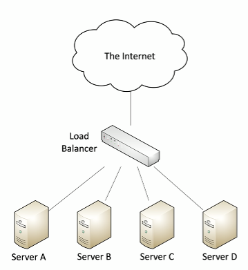

# OSI Model
- Open Systems Interconnection Reference Model.
- Used to describe a broad overview of how data traverses our systems.
- OSI can be applied to many different protocols. Many protocols might operate at an individual layer of the OSI model.

## Layers of the OSI Model

| Layer | Name         | Mnemonic |
|------|-------------|----------|
| 7    | Application  | All      |
| 6    | Presentation | People   |
| 5    | Session      | Seem     |
| 4    | Transport    | To       |
| 3    | Network      | Need     |
| 2    | Data Link    | Data     |
| 1    | Physical     | Processing |

### Layer 1 - Physical Layer 
- Describes the physical signals that we send through the cables on our network
- This layer isn't about protocols.
- Cable related problems would be considered as a physical layer problem.
- Troubleshooting includes fixing your cabling, running loopback tests, testing/replacing cables, swapping adapter cards, etc.

### Layer 2 - Data Link Layer
- Fundamental layer used to communicate between two devices on the network.
- Also referred to as the MAC (Media Access Control) address layer/DLC (Data Link Control) layer. Commonly associated with the network cards that are in our devices. 
- Physical Address of device = Data link control address/MAC address. 
- Also referred to as the "switching" layer because the network switches that we use on our network determine how to forward traffic based on the destination MAC address. 

### Layer 3 - Network Layer
- Also referred to as the "routing" layer because this is the layer that routers use to determine how to forward traffic based on the destination IP (Internet Protocol) address.
- Fragments frames to traverse different networks.

### Layer 4 - Transport Layer
- We're referring to the ability to transport information from one device to another.
- Also referred to as the "post office" layer since it is responsible for getting your information from one side of the network to the other. 
- Protocols that are often used and operate at layer 4 are TCP (Transmission Control Protocol) and UDP (User Datagram Protocol).
- These protocols are responsible for getting all of the information within our IP packets from one device to another.

### Layer 5 - Session Layer
- Provides communication management between point A and point B.
- Responsible for anything related to initiating a session, stopping a session, restarting a session. 
- Using a control protocol or tunneling information within existing data is done using layer 5.

### Layer 6 - Presentation Layer
- Responsible for putting all the data in a format that will be eventually seen by human eyes.
- This refers to character encoding, application encryption & decryption.
- Often combined with the Application Layer.

### Layer 7 - Application Layer
- The Top Layer.
- This is the layer that we see on our screen. 
- Anytime we are interacting with an application we are operating at layer 7.
- Common protocols that would operate at OSI layer 7 are HTTP & HTTPS, FTP, DNS, POP3, and many more other application protocols. 

## Real-world to OSI model
| Layer | Name         | Examples/Concepts |
|-------|--------------|-------------------------------|
| 7    | Application  | UI      |
| 6    | Presentation | Application encryption (SSL/TLS)   |
| 5    | Session      | Control protocols, tunneling protocols     |
| 4    | Transport    | TCP segment, UDP datagram       |
| 3    | Network      | IP Address, Router, Packet  |
| 2    | Data Link    | Frame, MAC address, Extended Unique Identifier (EUI-48, EUI-64), Switch |
| 1    | Physical     | Cables, fiber, and the signal itself |

# Networking Devices
- Devices that work together to take data from one part of the network and move it to another part of the network.

    ## Router
    - A router allows us to take data on one IP subnet and route that information to a different IP subnet.
    - These subnets may be next to each other in the same data center, or may be in different parts of the world.
    - Referred as an OSI layer 3 device i.e. the network layer device.
    - Routers use IP addresses that are referred to in the 3rd layer to determine the next hop for this information.
    - This routing functionality can also be included inside of an existing switch and often referred to as "layer 3 switches".
    - Often connects diverse network types:
        - LAN (Local Area Network), WAN (Wide Area Network), copper-based connections, fiber-based connections.

    ## Network Switch
    - Switches operate at the MAC address layer to be able to forward traffic i.e. at the OSI layer 2 (Data Link Layer).
    - These operate mostly in hardware and the hardware inside of these switches is referred to as an ASIC i.e. an Application-Specific Integrated Circuit.
    - Many switches may provide Power over Ethernet (PoE) i.e. includes power on the same ethernet connection.

    ## Firewalls
    - A traditional firewall allows you to filter traffic based on a TCP or UDP port number.
    - A modern firewall i.e. Next-Generation Firewall (NGFW) is able to identify applications traversing your network and allow you to manage whether that application should be allowed or not allowed on your network.
    - Most firewalls allow us to encrypt traffic traversing the network through a VPN(Virtual Private Network).
    - It is common to have a firewall at one remote site and a firewall at another remote site to be able to create an encrypted tunnel between these firewalls using this VPN functionality.
    - Most firewalls can be layer 3 devices (routers) because they are often sitting right between the ingress and egress point of your network, where all the traffic on the inside of your network is going to the outside of the internet connection and your internet traffic is coming inbound to your local network.
    - To perform the above stated functionality, many firewalls provide Network Address Translation (NAT) and support dynamic routing too.

    ## IDS or IPS
    - Many data centers might also have standalone IDS or IPS devices (although much of their functionality is integrated into Next-Gen Firewalls).
    - IDS = Intrusion Detection System
    - IPS = Intrusion Prevention System
    - Both IDS & IPS work in similar ways. 
    - They are looking for attacks that are inbound to the network.
    - They are able to identify, alert, and in many cases, prevent that attack.
    - These attacks might be exploits against Operating Systems, applications, etc.
    - They might take advantage of buffer overflows, cross-site scripting, and other vulnerabilities.
    - Detection vs. Prevention
        - Detection: Alarm or alert if it ever sees inbound attacks.
        - Prevention: Block or stop that particular attack before it gets inside the network.
    
    ## Load Balancer
    - Distributes the load across multiple physical servers. This load balancing is invisible to end-users.
    - Data centers have a large number of web servers or database servers in farms that are used with this load balancer to maintain uptime and availability.
    - Load Balancers are very good at identifying server outages. So if one of the server fails due to any reason the load balancer will recognize this issue and take that particular server out of the rotation and continue to provide access to these services using the remaining servers.
    
    - Load Balancers can also optimize the communication by performing TCP offloading so the communication to the servers are occurring as quickly as possible.
    - They can also act as SSL offload by providing the encryption and decryption capabilities instead.
    - Data can also be cached on the load balancer so it will provide fast responses.
    - They are also very good at prioritizing different types of traffic over others. This prioritization is performed using Quality of Service (QoS)
    - They also provide application-centric balancing (content switching) where certain pages may be located on certain servers and all of the requests to those pages would go exclusively to those individual servers.

    ## Proxies
    - Sits between the users and the external network and manages these connections.
    - The proxy is responsible for taking the user's request, performing the request on their behalf, receiving the answer to that request, verifying that the answer doesn't contain some type of malicious code/software, and then providing that answer to the end user.
    - Useful for caching information, access control, URL filtering, content scanning.
    - Applications may need to know how to use the proxy, this is the explicit behaviour of proxy.
    - Not all proxies have to behave in an explicit manner, there are also transparent proxies that work invisibly without making any changes to the OS or the application.

    ## NAS vs. SAN
    - NAS = Network Attached Storage
        - Connect to a shared storage device across the network.
        - Provides file-level access.
    - SAN = Storage Area Network
        - Works like a local storage device.
        - Provides block-level access.
        - Very efficient reading and writing.
    - It is very common to put the NAS or the SAN on its own isolated network which has very high bandwidths.

    ## Access Point (AP)
    - Allows a device to communicate wirelessly to the rest of the network.
    - An access point is not a wireless router. A wireless router is a router and an access point and a switch in a single device.
    - AP bridges the connection between the wireless network and the wired ethernet network.
    - OSI layer 2 device.
    - Multiple access points are used to make sure everyone in a large area is able to access the wireless network wherever they are in that area. These APs can be anywhere in the local network or in a remote site network.
    - Security settings, access policies and other configuration parameters within that AP are to be managed.
    - There has to be seamless network access so people can roam from one AP to another and always stay connected to the network.

    ## Wireless LAN controllers
    - Instead of connecting to each individual access point, there is a centralized management tool for all access points which is the wireless LAN controller.
    - A single "pane of glass".
    - With this single device we can deploy new access points with a full configuration.
    - In this device, performance and security monitoring can also be set up.
    - Changes can be configured and deployed to all access point from this one device.
    - Useful with creating reports on access point use.
    - Usually a proprietary system.